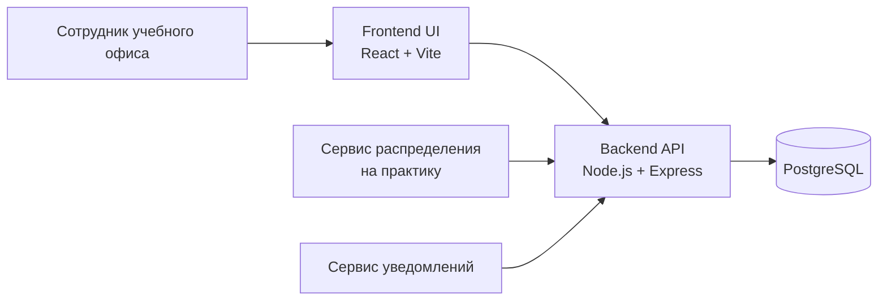

# Архитектура сервиса

## Назначение

Проект реализует сервис управления данными студентов для учебного офиса вуза. Сервис предназначен для хранения, актуализации, поиска и предоставления данных о студентах через пользовательский интерфейс и HTTP API.

Сервис не выполняет автоматическое распределение студентов на практику. Он выступает источником данных для сотрудников учебного офиса и внешних систем.

## Архитектурная схема

## Основные компоненты

### Frontend

- реализован на `React` и `TypeScript`
- предоставляет интерфейс для просмотра, поиска, редактирования и сравнения данных студентов
- использует backend API по HTTP

### Backend API

- реализован на `Node.js` и `Express`
- предоставляет основной публичный API через `/api/v1`
- сохраняет legacy-маршрут `/api/bootstrap` для совместимости с текущим frontend
- выполняет CRUD-операции для студентов, согласий и справочников
- отдает Swagger/OpenAPI-документацию

### PostgreSQL

- используется как основное хранилище данных
- содержит таблицы студентов, согласий и справочников
- инициализируется миграциями и сидированием

## Основные данные сервиса

Сервис хранит данные, которые могут использоваться при подготовке к распределению студентов на практику:
- ФИО и контакты студента
- образовательная программа и курс
- средний балл
- языки
- hard skills
- soft skills
- практический опыт
- предпочтения по стажировке или практике
- согласия на обработку данных

## Подход к API

- основным публичным интерфейсом считается `/api/v1`
- `GET /api/v1/students` поддерживает поиск, фильтрацию, сортировку и пагинацию
- `GET /api/v1/programs`, `GET /api/v1/languages`, `GET /api/v1/skills`, `GET /api/v1/soft-skills` отдают справочники отдельно
- `GET /api/v1/consents` и `POST /api/v1/consents` позволяют работать с согласиями
- `/api/bootstrap` сохранен только для совместимости с текущим frontend

## Ограничения текущей архитектуры

- backend реализован в компактном виде и не разделен на отдельные слои контроллеров и сервисов
- аутентификация и авторизация в текущей версии демонстрационные
- предметная область практик представлена через данные студентов, без отдельной сущности практики
