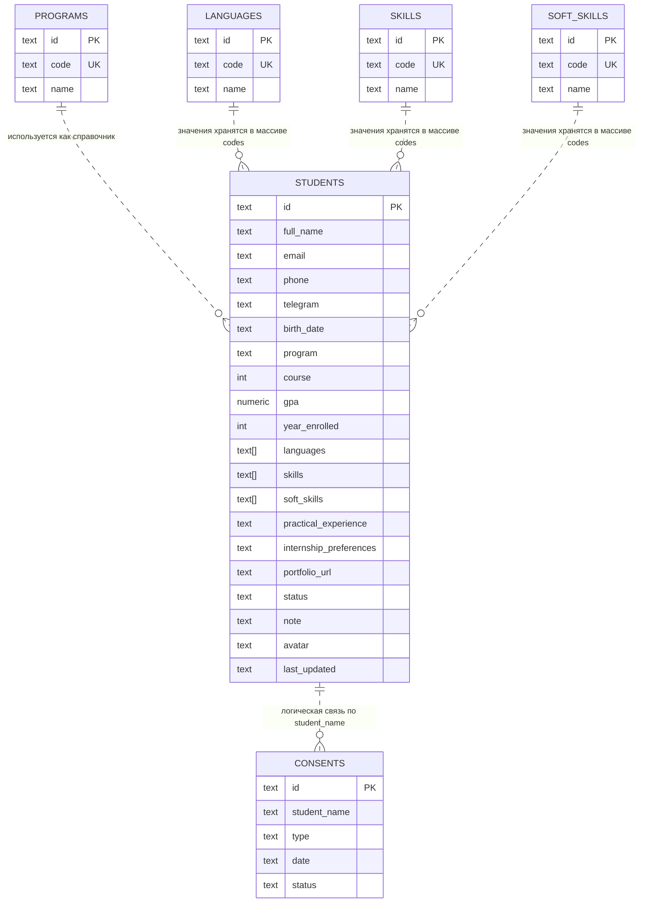

# ER-диаграмма базы данных

## Описание

Текущая база данных включает таблицы студентов, согласий и справочников. Справочники используются как источники допустимых значений, однако в текущей реализации данные студента хранятся в основном в денормализованном виде: часть полей записывается как строки или массивы строк, а не как внешние ключи.

Это соответствует текущей реализации проекта и упрощает демонстрационный сценарий.

## ER-диаграмма

## Практические замечания

- таблица `students` является центральной сущностью сервиса
- таблица `consents` хранит согласия студентов на обработку данных
- таблицы `programs`, `languages`, `skills`, `soft_skills` являются справочниками
- в текущей версии между `students` и `consents` нет физического внешнего ключа, связь носит логический характер
- в текущей версии `program`, `languages`, `skills` и `soft_skills` в записи студента не реализованы как внешние ключи на отдельные таблицы
